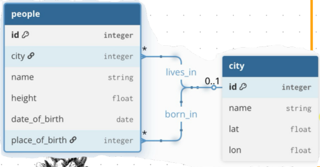
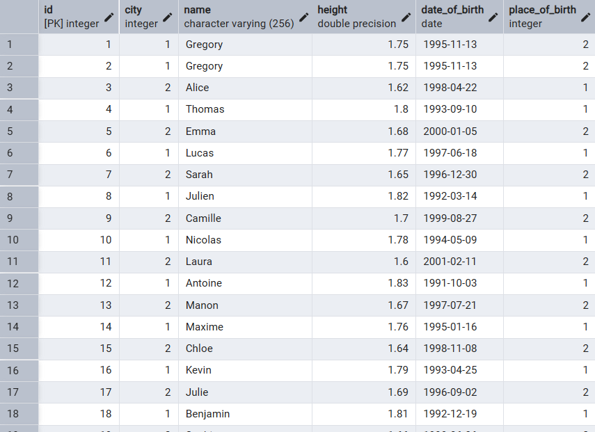
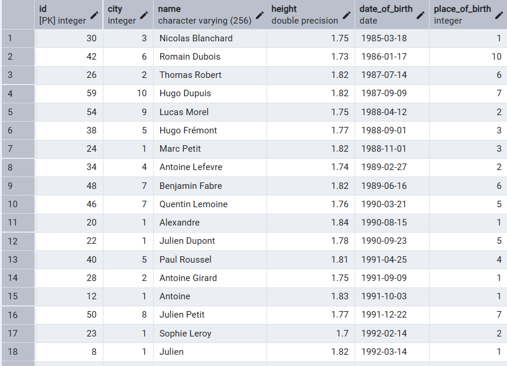
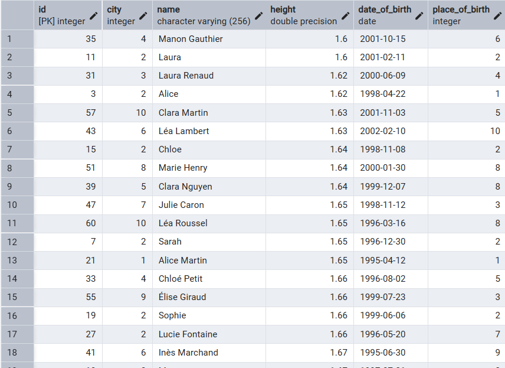
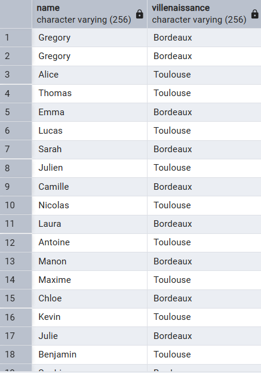
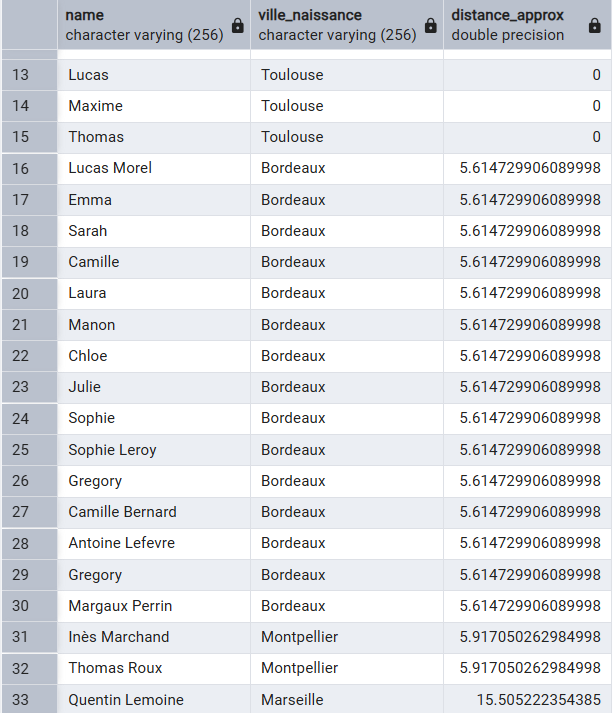

# Le SQL comment ça marche ?

Ici nous allons comprendre comment faire pour insérer et recupérer des données dans une base de données



*Figure 1 – Schéma de base de données*

Voici celle sur laquelle on veut faire notre excercice.

[Lien vers le GIT qui contient tout les scripts](https://github.com/AxFeed/PrairieIA/tree/main/SQL)

##Créer les tables

Pour qu'on puisse faire des requêtes sur notre base, il faut d'abord avoir des tables qui contiendront les différentes données.
Pour cela, il faut écrire deux scripts pour créer nos tables people et city.


People
```sql
	CREATE TABLE people(id SERIAL PRIMARY KEY, city integer NOT NULL, name varchar(256) NOT NULL, height float NOT NULL, date_of_birth date NOT NULL, place_of_birth integer NOT NULL);
```

City
```sql
	CREATE TABLE city(id SERIAL PRIMARY KEY, name varchar(256) NOT NULL, lat float NOT NULL, lon float NOT NULL);
```

- CREATA TABLE: Permet de dire qu'on veut créer une table dans notre base
- SERIAL PRIMARY KEY: Indique que cette variable sera la clé primaire de notre table et SERIAL permet d'indiquer que cette donnée s'incrémentera toute seule
- NOT NULL: Indique à la base de donnée que cette donnée ne pourra pas être nulle

- integer: Indique à la base de données que cette donnée sera un nombre entier
- varchar(X): Indique à la base de données que cette donnée sera une chaine de caractère de X caractère max
- float: Indique à la base de données que cette donnée sera un nombre décimal
- date: Indique à la base de données que cette donnée sera une date
	

##Insérer notre jeu de donnée

Même si c'est demander plus tard dans l'exercice, maintenant nous avons tout de même besoin de plusieurs données dans nos tables pour pouvoir y effectuer des requêtes

Remplir City
```sql
	INSERT INTO city (name, lat, lon) VALUES
	('Paris', 48.8566, 2.3522),
	('Lyon', 45.7640, 4.8357),
	('Marseille', 43.2965, 5.3698),
	('Toulouse', 43.6047, 1.4442),
	('Bordeaux', 44.8378, -0.5792),
	('Lille', 50.6292, 3.0573),
	('Nantes', 47.2184, -1.5536),
	('Strasbourg', 48.5734, 7.7521),
	('Montpellier', 43.6119, 3.8772),
	('Rennes', 48.1173, -1.6778),
	('Reims', 49.2583, 4.0317),
	('Le Havre', 49.4944, 0.1079),
	('Saint-Étienne', 45.4397, 4.3872),
	('Toulon', 43.1242, 5.9280),
	('Grenoble', 45.1885, 5.7245),
	('Dijon', 47.3220, 5.0415),
	('Angers', 47.4784, -0.5632),
	('Nîmes', 43.8367, 4.3601),
	('Villeurbanne', 45.7719, 4.8902),
	('Clermont-Ferrand', 45.7772, 3.0870);
```

Remplir People
```sql
	INSERT INTO people (city, name, height, date_of_birth, place_of_birth) VALUES
	(1, 'Jean Dupont', 1.78, '1990-05-12', 2),
	(2, 'Marie Martin', 1.65, '1988-11-03', 1),
	(3, 'Paul Durand', 1.82, '1995-02-20', 5),
	(4, 'Sophie Bernard', 1.70, '1992-07-15', 4),
	(5, 'Lucas Petit', 1.75, '2000-01-30', 3),
	(6, 'Emma Robert', 1.68, '1997-09-08', 8),
	(7, 'Hugo Moreau', 1.80, '1985-12-25', 6),
	(8, 'Camille Lefevre', 1.62, '1993-03-18', 7),
	(9, 'Thomas Garcia', 1.85, '1989-06-09', 9),
	(10, 'Laura Roux', 1.66, '1996-10-22', 10),
	(11, 'Nicolas Font', 1.74, '1987-01-14', 12),
	(12, 'Julie Vincent', 1.69, '1994-04-27', 11),
	(13, 'Antoine Blanchard', 1.81, '1991-08-05', 13),
	(14, 'Claire Faure', 1.64, '1998-12-11', 14),
	(15, 'Maxime Giraud', 1.77, '1986-09-02', 15),
	(16, 'Alice Chevalier', 1.71, '1999-02-17', 16),
	(17, 'Julien Andre', 1.83, '1990-11-29', 18),
	(18, 'Manon Perez', 1.67, '1995-05-06', 17),
	(19, 'Romain Lopez', 1.79, '1984-07-21', 20),
	(20, 'Sarah Molina', 1.63, '2001-03-10', 19);
```

- INSET INTO: Indique qu'on va insérer des données dans la table X et dans quelles colonnes
- VALUES: Indique quelles données on va insérer dans chaque colonne

##Ajouter une ville

Pour ajouter une ville, on a l'exemple au dessus, on peut juste taper
```sql
	INSERT INTO city (name, lat, lon) VALUES ('Paris', 48.8566, 2.3522);
```

ATTENTION, ici, si vous avez déjà utiliser le jeu de donnée au dessus, vous aurez Paris deux fois dans votre base de données

##Ajouter une personne

Pour ajouter une personne, on a l'exemple au dessus, on peut juste taper
```sql
	INSERT INTO people (city, name, height, date_of_birth, place_of_birth) VALUES (1, 'Jean Dupont', 1.78, '1990-05-12', 2);
```

Quand vous rentrer une date en SQL faîtes attention, celle-ci dépend de votre base. La plupart du temps il faut rentrer dans le format Américain yyyy-MM-dd

ATTENTION, ici, si vous avez déjà utiliser le jeu de donnée au dessus, vous aurez Jean Dupont deux fois dans votre base de données


##Ajouter 20 personnes d'un coup

Ca tombe bien c'est exactement ce qu'on fait dans le jeu de donnée !

##Récupérer la liste des personnes

Pour récupérer une liste de personne, il faut éxécuter le code suivant
```sql
	SELECT * FROM people;
```

- SELECT: Indique à la base qu'on va récupérer une ou des données dans la base
- étoile: Indique qu'on va récupérer toutes les données de notre TABLE



*Figure 2 – Réponse du SELECT ALL*

##Récupérer la liste des personnes de la plus vieille à la plus jeune

Pour récupérer une liste de personne trié de la plus vieille à la plus jeune, il faut éxécuter le code suivant
```sql
	SELECT * FROM people ORDER BY date_of_birth;
```

- ORDER BY: Indique à la base qu'on veut les données triées dans l'ordre décroissant



*Figure 3 – Réponse du ORDER BY date_of_birth*

##Récupérer la liste des personnes de la plus petite à la plus grande

Pour récupérer une liste de personne trié de la plus petite à la plus vieille, il faut éxécuter le code suivant
```sql
	SELECT * FROM people ORDER BY height asc;
```

- asc: Permet de dire qu'on veut trier par ordre croissant



*Figure 4 – Réponse du ORDER BY height*

##Récupérer la liste des personnes avec le nom de la ville de naissance

Pour récupérer une liste de personne avec le nom de leur ville de naissance, il va falloir croiser les données de nos deux tables afin de ne plus avoir un nombre mais le nom de la ville
```sql
	SELECT p.name, c.name as villeNaissance FROM people as p JOIN city c ON c.id = p.place_of_birth;
```

- as: Permet de donner un label à la donnée
- JOIN: Indique à la base qu'on va effectuer une jointure (croiser) sur des tables
- ON: Indique sur quoi on se base pour les croiser



*Figure 5 – Réponse du SELECT avec le nom de la ville de naissance*

##Récupérer la liste des personnes groupées selon leur ville

Pour récupérer une liste de personne groupée selon leur ville, il faut exécuter le code suivant
```sql
	SELECT c.name as ville, array_agg(p.name) as personne FROM people p JOIN city c ON p.city = c.id GROUP BY c.name ORDER BY c.name;
```

- array_agg: Permet de dire qu'on veut plusieurs valeurs d'une colonne dans un tableau
- GROUP_BY: Indique qu'on va regrouper les données selon un critére


*Figure 6 – Réponse du SELECT GROUP BY city*

##Récupérer la liste des personnes de celle néé la plus proche à la plus loin de Toulouse

Pour récupérer une liste de personne née la plus proche à la plus loin de Toulouse, il faut exécuter le code suivant
```sql
	SELECT 
    p.name,
    c.name AS ville_naissance,
    ((c.lat - c_toulouse.lat)^2 + (c.lon - c_toulouse.lon)^2) AS distance_approx
	FROM people p
	JOIN city c ON p.place_of_birth = c.id
	JOIN city toulouse ON toulouse.id = 1
	ORDER BY distance_approx ASC;
```

Grosso modo, on fait un calcul qu'on stocke dans un label distance_approx et qu'on va utiliser pour trier notre liste



*Figure 7 – Réponse du SELECT avec calcul*