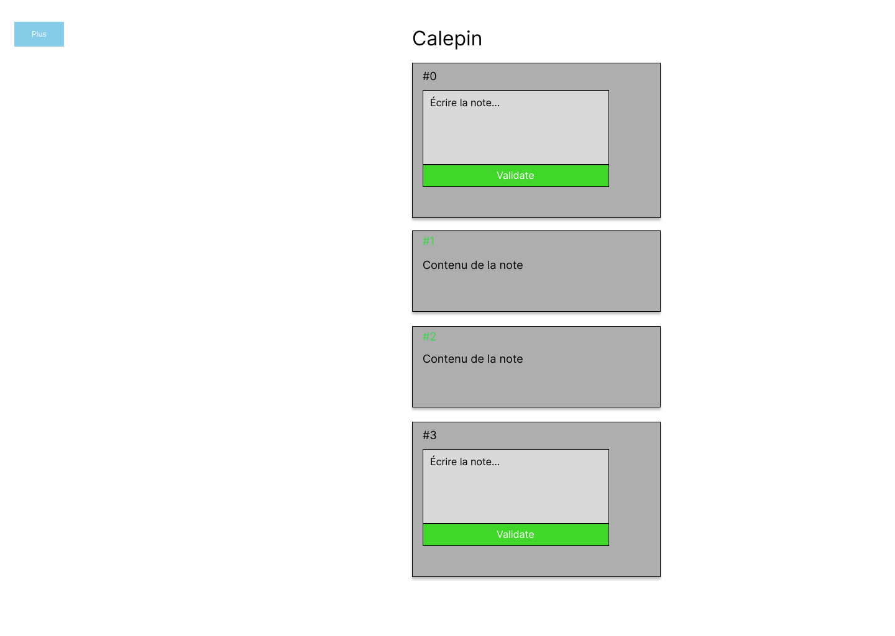
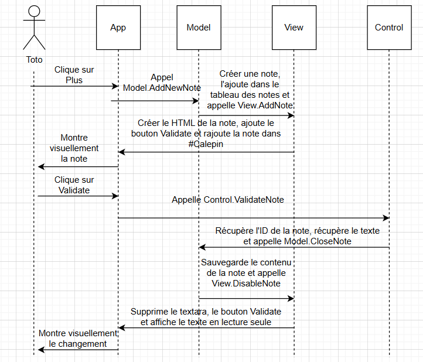
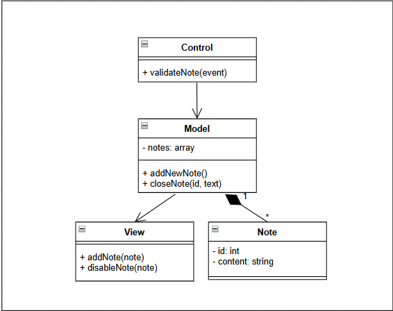

# Conception de l’application

Cette page présente les différents éléments de conception utilisés pour décrire le fonctionnement et l’interface de l’application de prise de notes.
Les diagrammes et le wireframe permettent de comprendre le système avant son implémentation.

[Lien Git de l'application](https://gitlab.com/Nasyourte/exo-retroengineering)

---

## Diagramme de cas d’utilisation (Use Case)

Le diagramme de cas d’utilisation permet d’identifier les **interactions entre l’utilisateur
et l’application**.  
Il met en évidence les fonctionnalités principales offertes par le système.

Dans cette application, l’utilisateur peut :
- ajouter une nouvelle note
- écrire le contenu d’une note
- valider une note

Le diagramme ci-dessous représente ces interactions de manière globale.

*Figure 1 – Diagramme de cas d’utilisation de l’application*

---

## Wireframe

Le wireframe représente la **structure visuelle de l’interface utilisateur**.
Il s’agit d’une maquette basse fidélité, sans choix graphiques définitifs,
dont l’objectif est de définir l’organisation des éléments à l’écran.

Le wireframe de l’application montre :
- un bouton « Plus » pour ajouter une note
- un titre « Calepin »
- une liste de notes affichées sous forme de cartes
- les deux états possibles d’une note : édition et validation

*Figure 2 – Wireframe de l’interface principale*

---

## Diagramme d’activité (Activity Diagram)

Le diagramme d’activité décrit le **flux de fonctionnement de l’application**.
Il permet de visualiser l’enchaînement des actions, depuis l’interaction utilisateur
jusqu’à la mise à jour de l’interface.

Le diagramme présente notamment :
- l’ajout d’une nouvelle note
- l’édition du contenu
- la validation de la note
- la réponse visuelle affichée à l’utilisateur

*Figure 3 – Diagramme d’activité de l’application*

---

## Diagramme de séquence (Sequence Diagram)

Le diagramme de séquence illustre les **échanges entre les différentes parties de l’application**
selon l’architecture MVC (Model – View – Control).

Il montre :
- les actions de l’utilisateur
- les appels entre Control, Model et View
- la mise à jour des données
- la mise à jour de l’interface utilisateur

Ce diagramme permet de comprendre l’ordre chronologique des interactions.

*Figure 4 – Diagramme de séquence de l’application*

---

## Diagramme de classes (Class Diagram)

Le diagramme de classes montre **la structure des données et des objets** dans l’application,
ainsi que leurs relations selon l’architecture MVC (Model-View-Control).

### Classes principales

- **Note**
  - `- id: int` (private) – identifiant unique de la note
  - `- content: string` (private) – texte de la note
- **Model**
  - `- notes: array` (private) – tableau de toutes les notes
  - `+ addNewNote()` – crée une nouvelle note
  - `+ closeNote(id, text)` – sauvegarde le contenu d’une note
- **View**
  - `+ addNote(note)` – affiche une nouvelle note
  - `+ disableNote(note)` – met la note en lecture seule
- **Control**
  - `+ validateNote(event)` – récupère les informations et déclenche la sauvegarde

### Relations principales

- Control → Model : utilise `closeNote()`
- Model → View : utilise `addNote()` et `disableNote()`
- Model *contient* Note (`1..*`)
- Note est manipulée uniquement via Model

### Diagramme

*Figure 5 – Diagramme de classes de l’application*

---

## Conclusion

L’utilisation conjointe des diagrammes UML et du wireframe permet d’avoir une vision complète de l’application :

- le **Use Case** décrit les fonctionnalités
- le **Wireframe** décrit l’interface utilisateur
- le **Diagramme d’activité** décrit le fonctionnement global
- le **Diagramme de séquence** décrit les échanges internes
- le **Digramme de classe** décrit les variables, les fonctions et les relation entre chaque classe

Ces éléments facilitent la compréhension, la maintenance et l’évolution du projet.

Pour ce qui est des éléménts d'amélioration possible :

- Afficher directement une note au début sans cliquer sur "Plus"
- Pouvoir supprimer une note
- Mettre le bouton "Plus" en dessous de la dernière note
- Valider les notes automatiquement quand l'utilisateur à arrêter de taper
- Pouvoir modifier une note
